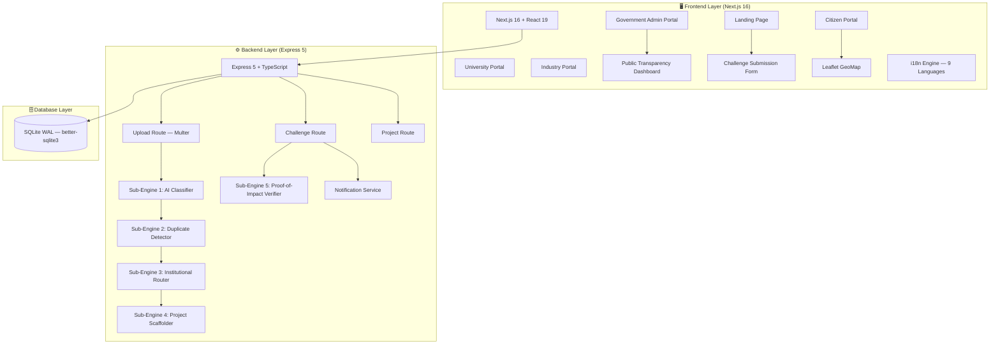

<div align="center">


# 🏛️ SRIJAN

### Societal Research, Innovation & Jharkhand Academic Network

[](https://nextjs.org/)
[](https://expressjs.com/)
[](https://www.typescriptlang.org/)
[](https://www.sqlite.org/)
[](https://leafletjs.com/)
[](https://react.dev/)
[](https://www.education.gov.in/nep)
[](https://en.wikipedia.org/wiki/Internationalization_and_localization)

**Team Merge_Conflicts · Smart India Hackathon 2026**

*Bridging citizens, universities, and industry to solve Jharkhand's societal challenges through collaborative innovation.*

[Architecture](#-system-architecture) · [AI Engines](#-ai-engine-deep-dive-5-sub-engines) · [Setup Guide](#-getting-started) · [Features](#-key-features)

</div>

---

## 📋 Table of Contents

- [Overview](#-overview)
- [The Problem](#-the-problem)
- [Our Solution](#-our-solution)
- [System Architecture](#-system-architecture)
- [Key Features](#-key-features)
- [AI Engine Deep Dive (5 Sub-Engines)](#-ai-engine-deep-dive-5-sub-engines)
- [Tech Stack](#-tech-stack)
- [Project Structure](#-project-structure)
- [Getting Started](#-getting-started)
- [Environment Variables](#-environment-variables)
- [API Reference](#-api-reference)
- [Pages & Routes](#-pages--routes)
- [How to Use (Step-by-Step)](#-how-to-use-step-by-step)
- [Database Schema](#-database-schema)
- [Internationalization (i18n)](#-internationalization-i18n)
- [Innovation Highlights](#-innovation-highlights)
- [Why SRIJAN?](#-why-srijan)
- [Team](#-team)
- [License](#-license)

---

## 🌐 Overview

**SRIJAN** (Societal Research, Innovation & Jharkhand Academic Network) is a full-stack platform that crowdsources **real-world societal challenges** from citizens of Jharkhand and intelligently routes them to **Higher Education Institutions (HEIs)** and **industry partners** for collaborative research, innovation, and deployment — aligned with **NEP 2020** experiential learning mandates.

Built by **Team Merge_Conflicts** for the **Smart India Hackathon 2026**, SRIJAN demonstrates how AI-powered triage, geospatial duplicate detection, multi-factor institutional routing, and automated academic credit scaffolding can transform grassroots problems into university-led R&D projects that deliver real impact.

> **💡 Key Insight:** India's rural districts generate thousands of civic and societal challenges annually — broken hand pumps, contaminated water, failing crops — but there's **no structured pipeline** to convert these into actionable engineering R&D. SRIJAN creates that pipeline, connecting the *last mile citizen* to the *nearest capable university* with AI-driven precision.

---

## 🚨 The Problem

<div align="center">

| Problem | Impact |
|---------|--------|
| 🔍 **No structured challenge pipeline** | Citizen grievances go unrouted; universities lack real-world problem statements |
| 🏫 **HEI-Industry disconnect** | Research stays academic; industry CSR lacks targeted deployment channels |
| 📝 **Manual, opaque allocation** | Government officials manually assign challenges with zero data-driven matching |
| 🗣️ **Vernacular & digital divide** | Tribal communities (Santhali, Ho, Mundari speakers) are excluded from digital platforms |
| 📊 **No transparency dashboard** | Citizens have zero visibility into challenge resolution status |
| 🎓 **No academic credit linkage** | Students solving societal problems get no NEP 2020 experiential learning credits |
| 🔄 **Duplicate reporting** | Same problem reported 50+ times across a district with no consolidation |

</div>

---

## 💡 Our Solution

SRIJAN operates on **four integrated pillars**:

```
┌──────────────────────────────────────────────────────────────────────┐
│                              SRIJAN                                   │
├─────────────────┬─────────────────┬─────────────────┬────────────────┤
│  🧠 AI ENGINE   │  🏛️ MULTI-ROLE  │  🎓 NEP 2020    │  🌍 VERNACULAR │
│                 │  PORTALS        │  CREDIT ENGINE  │  INCLUSION     │
│                 │                 │                 │                │
│  5 Sub-Engines: │  Citizen,       │  Auto-scaffold  │  9 languages:  │
│  Classification,│  University,    │  4-stage project│  English,      │
│  Deduplication, │  Industry,      │  milestones,    │  Hindi,        │
│  Routing,       │  Government     │  ABC credits,   │  Santali,      │
│  Scaffolding,   │  Admin portals  │  faculty        │  Ho, Mundari,  │
│  Verification   │  with role-     │  verification & │  Kurukh,       │
│                 │  based access   │  IP tracking    │  Nagpuri,      │
│                 │                 │                 │  Khortha,      │
│                 │                 │                 │  Panchpargania │
├─────────────────┼─────────────────┼─────────────────┼────────────────┤
│  Triage (R&D vs │  Community feed │  185+ hrs / 7   │  Ol Chiki      │
│  Administrative)│  with endorse-  │  credits per    │  script for    │
│  Fit Score 0-100│  ments & map    │  project        │  Santali       │
│  Haversine 5km  │  Leaflet heatmap│  Rubric scoring │  Devanagari    │
│  cluster radius │  Audit trail    │  Patent/IP mgmt │  for others    │
└─────────────────┴─────────────────┴─────────────────┴────────────────┘
```

---

## 🏗️ System Architecture



**Data Flow:**
1. **Citizen submits** a challenge via voice note (Hindi/Santhali/Ho/Mundari) or text form
2. **Sub-Engine 1 (AI Classifier)** performs two-layer triage: Innovation Challenge vs Administrative Issue, extracts domain, technical core, academic field, urgency score
3. **Sub-Engine 2 (Duplicate Detector)** runs hybrid semantic cosine similarity + Haversine geospatial clustering (≥0.82 similarity within 5km radius)
4. **Sub-Engine 3 (Institutional Router)** computes Multi-Factor Fit Score: Disciplinary Alignment (50%) + Geographic Proximity (30%) + Institutional Bandwidth (20%)
5. **Sub-Engine 4 (Project Scaffolder)** auto-generates a 4-stage milestone roadmap with NEP 2020 ABC credit calculations
6. **Sub-Engine 5 (Verification Engine)** performs EXIF + GPS + baseline photo fraud detection before resolving challenges
7. **Notification Service** dispatches in-app, SMS demo, and voice demo alerts across the lifecycle

---

## ✨ Key Features

### 👥 Multi-Role Portal System

| Portal | Route | Who | Capabilities |
|--------|-------|-----|-------------|
| 🏠 **Landing Page** | `/` | Everyone | Platform overview, live stats, demo login |
| 👤 **Citizen Portal** | `/citizen` | Citizens, PRIs, Community Orgs | Submit challenges, track status, endorse, community feed, map view |
| 🏫 **University Portal** | `/university` | Faculty, Students | Browse assigned challenges, manage projects, track milestones, ABC credits, team management |
| 🏭 **Industry Portal** | `/industry` | CSR Heads, Industry Partners | Browse challenges, commit funding (CSR/Seed/Co-Dev/Mentorship), track disbursements |
| 🏛️ **Government Admin** | `/admin` | District Collectors, Dept. Officials | Review submissions, validate/reject, allocate to institutions, manage users, heatmap analytics, audit log |
| 📊 **Transparency Dashboard** | `/transparency` | Public (no login) | Real-time resolution stats, domain breakdown, district coverage, open data |
| 📝 **Submit Challenge** | `/submit` | Citizens | Guided multi-step submission with evidence upload, voice recording, geolocation |

### 🗺️ Interactive GeoMap (Leaflet)
- **Dynamic markers** for all challenges plotted on a Jharkhand district map
- Marker clustering and popup details with status badges
- Geo-coordinates auto-captured during submission

### 🌐 9-Language Internationalization
Full UI translation across **9 languages** including tribal languages with Ol Chiki and Devanagari script support:

| Language | Script | Code |
|----------|--------|------|
| English | Latin | `en` |
| Hindi | Devanagari | `hi` |
| Santali | Ol Chiki (ᱚᱞ ᱪᱤᱠᱤ) | `sat` |
| Ho | Latin | `ho` |
| Mundari | Devanagari | `mun` |
| Kurukh | Devanagari | `kru` |
| Nagpuri | Devanagari | `nag` |
| Khortha | Devanagari | `kha` |
| Panchpargania | Devanagari | `pan` |

### 📎 Multimodal Evidence Upload
- Images, videos, audio recordings, and documents via Multer
- Voice note recording with browser Web Speech API
- Demo transcription for Santhali, Ho, and Mundari (Bhashini API integration-ready)

### 🔔 Multi-Channel Notifications
- **In-app** real-time notification feed
- **SMS Demo** entries with simulated delivery status
- **Voice Demo** entries for low-literacy populations
- Lifecycle notifications: submission → validation → assignment → milestone → verification → resolution

### 📈 Real-Time Dashboard Statistics
Live platform metrics displayed on the landing page and transparency dashboard:
- Total challenges submitted, resolved, resolution rate
- HEIs engaged, industry partners, districts covered
- Academic credits awarded, patents filed, startups spawned
- Domain-wise breakdown with visual progress bars

---

## 🧠 AI Engine Deep Dive (5 Sub-Engines)

### Sub-Engine 1: Multimodal & Vernacular Problem Structuring Engine
**File:** `backend/src/services/aiService.ts`

Processes citizen input in **Hindi, Santhali, Ho, Mundari**, or English and extracts:

| Output Field | Description |
|-------------|-------------|
| `category` | Domain (Water, Health, Agriculture, Education, Infrastructure, Energy, Environment, Livelihood, Governance) |
| `subcategory` | Sub-domain (e.g., Water Supply, Drainage, Maternal Health, Crop Issues) |
| `priority` | Critical / High / Medium / Low |
| `urgencyScore` | 0–99 composite score |
| `technicalCore` | Engineering problem statement (e.g., "Groundwater contaminant detection and multi-stage filtration design") |
| `targetAcademicField` | Mapped university department (e.g., "Chemical & Environmental Engineering") |
| `triageType` | `INNOVATION_CHALLENGE` (needs R&D) or `ADMINISTRATIVE_ISSUE` (needs maintenance/repair) |
| `confidence` | 0.45–0.96 classification confidence |

**Two-Layer Triage Logic:**
```
Innovation Signals: 'sensor', 'prototype', 'smart', 'IoT', 'renewable', 'telemedicine'...
Administrative Signals: 'not working', 'broken', 'for months', 'no collection', 'pothole repair'...

if (adminScore > innovationScore) → ADMINISTRATIVE_ISSUE
else → INNOVATION_CHALLENGE
```

**Vernacular Keyword Support:** Domain rules include keywords in Hindi (हिन्दी), enabling classification from Hindi voice transcriptions. Example: `'पानी', 'जल', 'कुआं', 'नल', 'हैंडपंप'` → Water domain.

---

### Sub-Engine 2: Spatio-Semantic Vector Clustering & Endorsement Engine
**File:** `backend/src/services/duplicateService.ts`

Hybrid deduplication combining **semantic similarity** and **geospatial distance**:

| Check | Threshold | Method |
|-------|-----------|--------|
| Text Similarity | ≥ 0.82 cosine similarity | TF-IDF weighted token overlap with domain boost |
| Geographic Proximity | ≤ 5 km radius | Haversine formula (Earth radius = 6,371 km) |
| Combined Match | Both must pass | Semantic + Geospatial conjunction |

When duplicates are detected, they are merged into **Ecosystem Challenge Clusters** with aggregated endorsements and urgency scores, preventing the same village problem from fragmenting across 50+ individual submissions.

---

### Sub-Engine 3: Two-Sided Capability-to-Challenge Routing Engine
**File:** `backend/src/services/routingService.ts`

Computes a **Multi-Factor Institutional Fit Score (0–100%)** for each HEI:

| Factor | Weight | Method |
|--------|--------|--------|
| Disciplinary Alignment | 50% | Domain → Expertise tag matching (e.g., "Water" → ["Water Technology", "Environmental Engineering", "Civil Engineering"]) |
| Geographic Proximity | 30% | District → Institution proximity matrix (e.g., Ranchi → BIT Mesra = 0.95, NIT Jamshedpur = 0.70) |
| Institutional Bandwidth | 20% | Inverse of active project count (fewer active = more capacity) |

**Institutions in the routing matrix:**
- BIT Mesra, Ranchi
- IIT (ISM) Dhanbad
- NIT Jamshedpur
- RIMS Ranchi
- Ranchi University
- XLRI Jamshedpur
- Vinoba Bhave University

Recommendations include a **breakdown** showing individual factor scores and human-readable **reasons** for the match.

---

### Sub-Engine 4: Automated Academic Credit & Proposal Scaffolding Engine
**File:** `backend/src/services/projectService.ts`

Auto-generates a **4-stage project milestone roadmap** aligned with NEP 2020 Experiential Learning Framework:

| Stage | Phase | Hours | Credits | Rubric Weight | Deliverables |
|-------|-------|-------|---------|---------------|-------------|
| 1 | Ground Survey & Need Assessment | 40 hrs | 1.5 | 20% | Baseline Survey Report, GIS Site Map, Stakeholder Interviews |
| 2 | Prototyping & Lab Simulation | 65 hrs | 2.5 | 35% | Functional Prototype, Lab Performance Data, CAD Schematic |
| 3 | Field Testing & Deployment | 50 hrs | 2.0 | 30% | Field Trial Log, Citizen Feedback Sign-off, Efficacy Certificate |
| 4 | Handover & Pilot Sign-off | 30 hrs | 1.0 | 15% | Official Handover Deed, Maintenance Manual, NEP Credit Report |
| **Total** | | **185 hrs** | **7.0** | **100%** | |

Each project auto-generates a recommended title, technical abstract, and links milestone completion to ABC (Academic Bank of Credits) points.

---

### Sub-Engine 5: Reverse Proof-of-Impact Verification Engine
**File:** `backend/src/services/verificationService.ts`

Before resolving a challenge, performs three-layer fraud detection:

| Check | Method | Fraud Score |
|-------|--------|-------------|
| 📍 GPS Proximity | Camera GPS vs Challenge Location (Haversine) | +45 if > 2.0 km |
| 📷 EXIF Timestamp | Photo metadata timestamp validation | +40 if future timestamp |
| 📸 Baseline Comparison | Pre vs Post-deployment photo evidence | +15 if missing |

**Fraud Risk Score:** 0 (genuine) → 100 (fraudulent). Challenge resolution is **blocked** if score ≥ 50 or location doesn't match.

---

## 🛠️ Tech Stack

<div align="center">

| Layer | Technology | Purpose |
|-------|-----------|---------|
| **Frontend** | Next.js 16.3, React 19, TypeScript | SSR, routing, component architecture |
| **Styling** | Vanilla CSS (CSS Modules) | Scoped, maintainable styles |
| **Maps** | Leaflet + React-Leaflet | Interactive geospatial visualization |
| **Backend** | Express 5, TypeScript, Nodemon | REST API, middleware, hot-reload |
| **Database** | SQLite (WAL mode) via better-sqlite3 | Embedded, zero-config, production-ready |
| **File Upload** | Multer | Multipart form data handling |
| **i18n** | Custom React Context + locale files | 9-language support |
| **Fonts** | Noto Sans Devanagari, Noto Sans Ol Chiki | Tribal script rendering |
| **Auth** | React Context (demo mode) | Role-based access control |

</div>

---

## 📁 Project Structure

```
Merge_Conflicts_Smart_Education/
├── frontend/                          # Next.js 16 Frontend
│   ├── public/                        # Static assets (logos, images)
│   ├── src/
│   │   ├── app/
│   │   │   ├── page.tsx               # Landing page (hero, stats, portals)
│   │   │   ├── layout.tsx             # Root layout (providers, fonts, meta)
│   │   │   ├── globals.css            # Design system & global styles
│   │   │   ├── about/                 # About page
│   │   │   ├── submit/                # Challenge submission redirect
│   │   │   ├── transparency/          # Public transparency dashboard
│   │   │   ├── citizen/               # Citizen portal
│   │   │   │   ├── page.tsx           # Dashboard
│   │   │   │   ├── submit/            # Challenge submission form
│   │   │   │   ├── my-submissions/    # Track submitted challenges
│   │   │   │   ├── community/         # Community feed & endorsements
│   │   │   │   └── profile/           # Citizen profile
│   │   │   ├── university/            # University portal
│   │   │   │   ├── page.tsx           # Dashboard
│   │   │   │   ├── queue/             # Challenge assignment queue
│   │   │   │   ├── projects/          # Active R&D projects
│   │   │   │   ├── teams/             # Team management
│   │   │   │   ├── abc/               # Academic Bank of Credits
│   │   │   │   └── profile/           # Institution profile
│   │   │   ├── industry/              # Industry partner portal
│   │   │   │   ├── page.tsx           # Dashboard
│   │   │   │   ├── challenges/        # Browse challenges for funding
│   │   │   │   ├── commitments/       # CSR & funding commitments
│   │   │   │   └── profile/           # Partner profile
│   │   │   ├── admin/                 # Government admin portal
│   │   │   │   ├── page.tsx           # Admin dashboard
│   │   │   │   ├── submissions/       # Review all submissions
│   │   │   │   ├── review/            # Validate/reject challenges
│   │   │   │   ├── allocation/        # Allocate to institutions
│   │   │   │   ├── institutions/      # Manage HEIs
│   │   │   │   ├── partners/          # Manage industry partners
│   │   │   │   ├── heatmap/           # District-level GeoMap analytics
│   │   │   │   ├── users/             # User management
│   │   │   │   └── notifications/     # Notification center
│   │   │   └── actions/               # Server actions
│   │   ├── components/
│   │   │   ├── DynamicMap.tsx          # Leaflet map (dynamic import, SSR-safe)
│   │   │   ├── FilterBar.tsx          # Domain/status/district filters
│   │   │   ├── Modal.tsx              # Reusable modal component
│   │   │   ├── PortalLayout.tsx       # Shared portal sidebar layout
│   │   │   ├── SubmissionCard.tsx     # Challenge card component
│   │   │   └── LanguageSelector.tsx   # Language dropdown (9 languages)
│   │   ├── i18n/
│   │   │   ├── config.ts              # Locale definitions
│   │   │   ├── LanguageContext.tsx     # React context provider
│   │   │   ├── useTranslation.ts      # Translation hook
│   │   │   └── locales/               # Translation files (en, hi, sat, ho, mun, kru, nag, kha, pan)
│   │   └── lib/
│   │       ├── authContext.tsx         # Auth context (role-based demo login)
│   │       ├── store.tsx              # Global state management
│   │       └── mockData.ts           # Seed data (challenges, institutions, stats)
│   ├── package.json
│   └── tsconfig.json
│
├── backend/                           # Express 5 Backend
│   ├── src/
│   │   ├── server.ts                  # Entry point (Express app, routes, middleware)
│   │   ├── routes/
│   │   │   ├── upload.route.ts        # POST /api/upload — challenge submission + AI pipeline
│   │   │   ├── challenge.route.ts     # GET/PUT /api/challenges — CRUD + status transitions
│   │   │   └── project.route.ts       # GET/POST /api/projects — project management
│   │   ├── controllers/
│   │   │   ├── challenge.controller.ts # Challenge business logic
│   │   │   └── project.controller.ts   # Project business logic
│   │   ├── services/
│   │   │   ├── aiService.ts           # Sub-Engine 1: AI Classification & Vernacular NLP
│   │   │   ├── duplicateService.ts    # Sub-Engine 2: Spatio-Semantic Deduplication
│   │   │   ├── routingService.ts      # Sub-Engine 3: Institutional Fit-Score Routing
│   │   │   ├── projectService.ts      # Sub-Engine 4: NEP 2020 Project Scaffolding
│   │   │   ├── verificationService.ts # Sub-Engine 5: Proof-of-Impact Fraud Detection
│   │   │   └── notificationService.ts # Multi-channel notification dispatch
│   │   └── db/
│   │       ├── schema.sql             # Full SQLite schema (20+ tables)
│   │       ├── init.ts                # Database initialization
│   │       ├── index.ts               # Repository layer (typed queries)
│   │       └── seed.ts                # Seed data (institutions, users, challenges)
│   ├── package.json
│   └── tsconfig.json
│
├── scratch/
│   └── updateMock.js                  # Mock data update utility
├── .gitignore
└── README.md                          # ← You are here
```

---

## 🚀 Getting Started

### Prerequisites

- **Node.js** ≥ 18.x
- **npm** ≥ 9.x
- **Git**

### 1. Clone the Repository

```bash
git clone https://github.com/prathamb9/Merge_Conflicts_Smart_Education.git
cd Merge_Conflicts_Smart_Education
```

### 2. Install & Run the Backend

```bash
cd backend
npm install
npm rebuild better-sqlite3   # Required on Windows for native SQLite bindings
npm run dev
```

The backend starts on **http://localhost:5000** with SQLite auto-initialized and seeded.

### 3. Install & Run the Frontend

```bash
cd frontend
npm install
npm run dev
```

> **Windows Users:** If Turbopack fails, run with `next dev --webpack` instead. The `package.json` may already be configured for this.

The frontend starts on **http://localhost:3000**.

### 4. Open in Browser

Navigate to [http://localhost:3000](http://localhost:3000) and use the **Demo Login** section to enter as any role (Citizen, University, Industry, Government).

---

## 🔐 Environment Variables

### Backend (`backend/.env`)

| Variable | Default | Description |
|----------|---------|-------------|
| `PORT` | `5000` | Backend server port |

> The backend uses SQLite (file-based), so no external database configuration is needed. The database file is auto-created at `backend/.sicp-data/sicp.db`.

---

## 📡 API Reference

### Upload & Challenge Submission

| Method | Endpoint | Description |
|--------|----------|-------------|
| `POST` | `/api/upload` | Submit a new challenge (multipart form: text + evidence files). Triggers full AI pipeline (classification → deduplication → routing → scaffolding) |
| `GET` | `/api/challenges` | List all challenges with optional filters (status, domain, district) |
| `GET` | `/api/challenges/:id` | Get challenge details including AI classification, routing recommendations, and duplicate cluster |
| `PUT` | `/api/challenges/:id/status` | Update challenge status (validate, assign, reject, resolve) |
| `PUT` | `/api/challenges/:id/endorse` | Endorse a challenge (increment endorsement count) |

### Projects

| Method | Endpoint | Description |
|--------|----------|-------------|
| `GET` | `/api/projects` | List all R&D projects |
| `GET` | `/api/projects/:id` | Get project details with milestones, team, and credits |
| `POST` | `/api/projects` | Create a new project from a challenge assignment |

### Health

| Method | Endpoint | Description |
|--------|----------|-------------|
| `GET` | `/api/health` | Health check — returns `{ status: 'ok' }` |

---

## 🗺️ Pages & Routes

### Frontend Routes

| Route | Page | Auth Required |
|-------|------|--------------|
| `/` | Landing page — hero, stats, portals, demo login | No |
| `/submit` | Challenge submission redirect | No |
| `/transparency` | Public transparency dashboard | No |
| `/about` | About SRIJAN & NEP 2020 alignment | No |
| `/citizen` | Citizen dashboard | Citizen role |
| `/citizen/submit` | Challenge submission form (text, voice, evidence) | Citizen role |
| `/citizen/my-submissions` | Track my submitted challenges | Citizen role |
| `/citizen/community` | Community feed with endorsements & map | Citizen role |
| `/citizen/profile` | Citizen profile | Citizen role |
| `/university` | University dashboard — assigned challenges & stats | University role |
| `/university/queue` | Challenge assignment queue | University role |
| `/university/projects` | Active R&D projects | University role |
| `/university/teams` | Team management (faculty, students) | University role |
| `/university/abc` | Academic Bank of Credits tracker | University role |
| `/university/profile` | Institution profile & expertise | University role |
| `/industry` | Industry partner dashboard | Industry role |
| `/industry/challenges` | Browse challenges for funding | Industry role |
| `/industry/commitments` | CSR & funding commitment tracker | Industry role |
| `/industry/profile` | Partner profile & capabilities | Industry role |
| `/admin` | Government admin dashboard — platform-wide analytics | Government role |
| `/admin/submissions` | Review all submissions | Government role |
| `/admin/review` | Validate or reject challenges | Government role |
| `/admin/allocation` | Allocate challenges to institutions (with fit scores) | Government role |
| `/admin/institutions` | Manage Higher Education Institutions | Government role |
| `/admin/partners` | Manage industry partners | Government role |
| `/admin/heatmap` | District-level challenge heatmap (Leaflet) | Government role |
| `/admin/users` | User management | Government role |
| `/admin/notifications` | Notification center | Government role |

---

## 📖 How to Use (Step-by-Step)

### As a Citizen
```
① Visit the Landing Page → Click "Submit a Challenge"
② Fill in the form: title, description, district, block, village
③ Upload evidence: photos, videos, or record a voice note
④ AI automatically classifies domain, priority, and urgency
⑤ Track your submission in "My Submissions"
⑥ Endorse other citizens' challenges in "Community"
⑦ View challenge on the interactive map
```

### As a University
```
① Login as University role → View your dashboard
② Browse "Challenge Queue" for assigned problems
③ Accept a challenge → Auto-generated project scaffold appears
④ Manage your team: add faculty mentors and student researchers
⑤ Track milestones: complete deliverables, log student hours
⑥ Earn NEP 2020 ABC credits automatically
⑦ Submit proof-of-impact photos for verification
```

### As an Industry Partner
```
① Login as Industry role → Browse available challenges
② Commit funding: CSR, Seed Grant, Co-Development, or Mentorship
③ Track disbursement progress on your commitments dashboard
④ View matched institutions and their fit scores
```

### As a Government Admin
```
① Login as Government role → View platform-wide analytics
② Review new submissions → Validate or Reject with reason
③ Allocate validated challenges to institutions using AI fit scores
④ Monitor resolution progress on the district heatmap
⑤ Audit all platform actions via the audit log
⑥ Manage users, institutions, and industry partners
```

---

## 🗄️ Database Schema

The SQLite database contains **20+ tables** organized into logical modules:

| Module | Tables | Purpose |
|--------|--------|---------|
| **Users & Roles** | `users` | Multi-role user accounts (citizen, university, faculty, student, industry, government, superadmin) |
| **Institutions** | `institutions`, `institution_departments`, `institution_expertise` | HEI profiles with departments and expertise tags |
| **Challenges** | `challenges`, `challenge_evidence`, `challenge_seq` | Core challenge data with AI fields, evidence, and sequential IDs (CH-2026-000001) |
| **Duplicate Detection** | `duplicate_clusters`, `duplicate_matches` | Spatio-semantic cluster tracking |
| **Routing** | `routing_recommendations` | AI-generated institutional fit score recommendations |
| **Projects** | `projects`, `project_members`, `milestones`, `milestone_deliverables` | R&D project lifecycle with team and milestone tracking |
| **Industry** | `industry_partners`, `industry_capabilities`, `industry_csr_areas` | Partner profiles and CSR domain mapping |
| **Funding** | `funding_commitments` | CSR/Seed/Co-Dev/Mentorship funding with disbursement tracking |
| **Verification** | `verification_requests`, `verification_evidence` | Proof-of-impact with GPS, EXIF, and photo evidence |
| **Academic Credits** | `academic_credits` | NEP 2020 ABC credit ledger with faculty verification |
| **IP** | `ip_declarations` | Patent/Copyright/Trade Secret tracking per project |
| **Notifications** | `notifications` | Multi-channel notification log |
| **Endorsements** | `endorsements` | Citizen endorsement tracking (unique per user per challenge) |
| **Audit** | `audit_log` | Full audit trail of all platform actions |

---

## 🌍 Internationalization (i18n)

SRIJAN supports **9 languages** with a custom React Context-based i18n system:

```
frontend/src/i18n/
├── config.ts              # Locale definitions & fallback chain
├── LanguageContext.tsx     # React context provider
├── useTranslation.ts      # Translation hook: const { t } = useTranslation()
└── locales/
    ├── en.ts              # English (full — 150+ keys)
    ├── hi.ts              # Hindi (full — 150+ keys)
    ├── sat.ts             # Santali (Ol Chiki script)
    ├── ho.ts              # Ho
    ├── mun.ts             # Mundari
    ├── kru.ts             # Kurukh
    ├── nag.ts             # Nagpuri
    ├── kha.ts             # Khortha
    └── pan.ts             # Panchpargania
```

**Fallback chain:** `selected locale → Hindi (hi) → English (en)`

Custom Google Fonts loaded for script rendering:
- **Noto Sans Devanagari** — Hindi, Mundari, Kurukh, Nagpuri, Khortha, Panchpargania
- **Noto Sans Ol Chiki** — Santali

---

## 💡 Innovation Highlights

| Innovation | Description |
|-----------|-------------|
| 🧠 **Two-Layer AI Triage** | Separates R&D-worthy innovation challenges from routine administrative grievances using signal scoring — prevents hand pump repair requests from being routed to IITs |
| 🗺️ **Haversine Geospatial Clustering** | Prevents the same village problem from fragmenting across 50+ submissions by merging reports within a 5km radius with ≥82% semantic similarity |
| 📐 **Multi-Factor Fit Score** | Goes beyond keyword matching — factors in disciplinary alignment, geographic proximity, AND institutional bandwidth to find the *right* university |
| 🎓 **NEP 2020 ABC Auto-Scaffolding** | First platform to auto-generate 4-stage milestone roadmaps with real ABC credit calculations — 185 hours, 7 credits per project |
| 🔍 **EXIF + GPS Fraud Detection** | Prevents fake resolution reports by cross-checking camera GPS coordinates against the challenge location using Haversine distance |
| 🗣️ **9-Language Vernacular Support** | Includes Jharkhand's tribal languages (Santali in Ol Chiki script, Ho, Mundari, Kurukh) — not just Hindi and English |
| 🏛️ **Complete 4-Portal Ecosystem** | Not just a submission form — full lifecycle from citizen report → AI triage → institutional routing → R&D project → field deployment → impact verification |

---

## 🤔 Why SRIJAN?

| Feature | Traditional Grievance Portals | SRIJAN |
|---------|------------------------------|--------|
| Challenge Classification | Manual tagging | AI-powered 9-domain, 15-subcategory classification |
| Duplicate Detection | None | Spatio-semantic clustering (cosine + Haversine) |
| Institutional Routing | Manual allocation | Multi-factor fit score (discipline + proximity + bandwidth) |
| Academic Integration | None | NEP 2020 ABC credit scaffolding |
| Verification | Self-reported | EXIF + GPS + baseline photo fraud detection |
| Language Support | Hindi + English only | 9 languages including tribal (Santali, Ho, Mundari) |
| Transparency | Opaque | Public dashboard with real-time stats |
| R&D Pipeline | Doesn't exist | Citizen → University → Industry → Deployment |

---

## 👥 Team

<div align="center">

**Team Merge_Conflicts**

| Member | Role |
|--------|------|
| **Pratham Borgaonkar** | Full Stack Developer & Team Lead |
| **Team Members** | Smart India Hackathon 2026 |

</div>

---

## 📄 License

This project is built for the **Smart India Hackathon 2026** under the problem statement from the **Department of Higher and Technical Education, Government of Jharkhand**.

---

<div align="center">

**Built with ❤️ by Team Merge_Conflicts**

*Societal Research, Innovation & Jharkhand Academic Network*
*Department of Higher and Technical Education, Government of Jharkhand*

</div>
